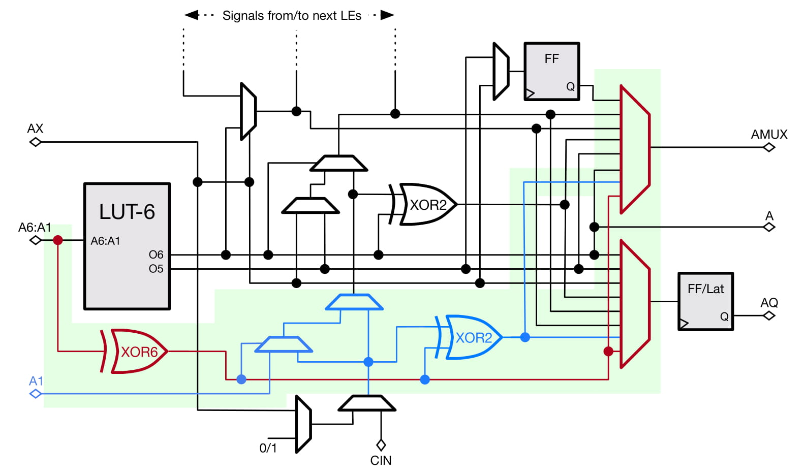
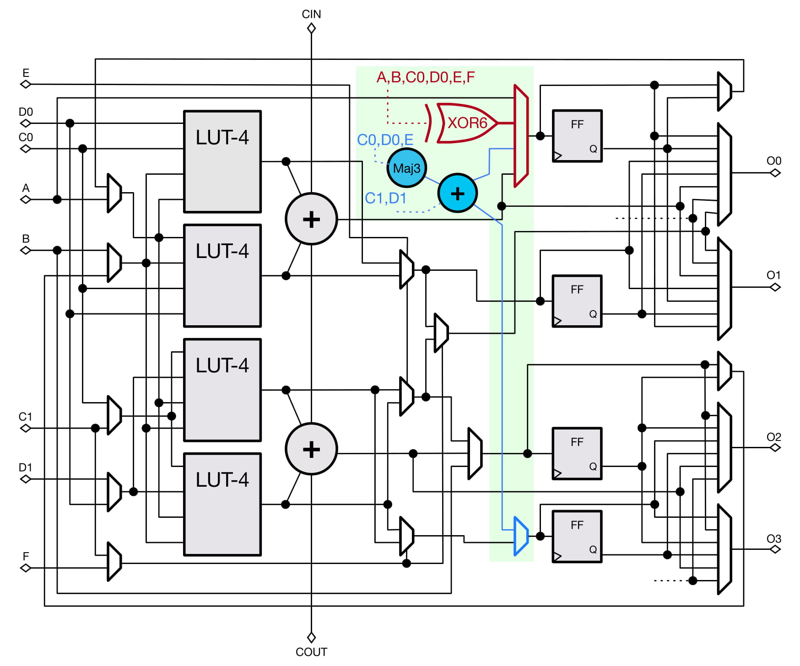

# LUXOR Artifacts

LUXOR is a set of proposed FPGA logic cell modifications to existing Intel/Xilinx FPGAs. These modifications provide significant area/performance improvements to modern applications while maintaining backward compatibility. This repository contains the source code for the LUXOR logic cell designs, as well as code to reproduce all experiments that demonstrate the benefits from LUXOR.

  
## Directory structure

```HDL/``` : Verilog source code of baseline/LUXOR/LUXOR+ designs. LUXOR/LUXOR+
features are enabled/disabled using parameters in the source code.

```GPCs/``` : Folder with all GPCs/compressors reported in the paper, expressed
in CSV files.

```scripts/``` : Scripts that reproduce all results.

```ref/``` : Logs/results/plots produced if `make` is run in the source
directory. To be used as reference.

```tests/``` : All micro-benchmarks evaluated in the paper.

## Compressor Tree Synthesis using ILP

This folder contains the ILP formulation and solver implementation for doing
efficient compressor tree synthesis for FPGAs. 

### Run

A Makefile is provided to simplify the process. Instructions:

1) Install CPLEX Studio 12.9 (available on an academic license)
    - Default install location is /opt/ibm/ILOG/CPLEX_Studio129/. For
      simplicity, we assume that this path is used during installation. If you
      choose your own custom path, please update line 10 in model.py.
2) Ensure that you have at least python3.6 available on your system.
3) pip3 install numpy pulp==2.0 pandas (`apt-get -y install python3-pip` if you
don't have pip3 installed on your system)
4) If you want to reproduce the plots, make sure R is installed. An R install
script (with required packages) is provided. It is recommended that you run
this script anyways to make sure that the R packages are installed on your
system. Run using `sudo ./scripts/install_r.sh`.
5) Type `make` to run all experiments, and reproduce the plots found in the paper.

### Generalised Parallel Counters (GPCs)

GPCs can be designed to be optimised for either Xilinx or Intel FPGA
architectures. We collect existing GPCs from literature, and propose new ones
that leverage on the new LUXOR/LUXOR+ features. These GPCs are then listed in
CSV files, and can be found in the ```GPCs/``` folder in this directory. The
```GPCs``` folder is further organised into two folders -- ```GPCs/Xilinx/```
and ```GPCs/Intel/``` -- that contain the CSV files for Xilinx and Intel FPGA
architectures respectively. Each of these sub-folders contain three files:

```Baseline.csv```: Curated list of existing GPCs that map well to modern
Intel/Xilinx FPGAs.

```LUXOR.csv```: Same curated list of existing GPCs, but with updated costs,
that map well to the proposed LUXOR modifications in the paper for both
Intel/Xilinx FPGAs.

```LUXOR+.csv```: Same curated list of existing GPCs, but with updated costs,
that map well to the proposed LUXOR+ modifications in the paper for both
Intel/Xilinx FPGAs. LUXOR+ for Xilinx FPGAs (X-LUXOR+) also contains novel
slice-based GPCs that are only feasible due to the additional features found in
LUXOR+ logic slices.

**Format of GPC-CSV file**

- Each line is a new GPC with at least 6 fields.
- CSV fields: `Name`, `M_e`, `K_e`, `M_e_c0`, `M_e_c1`, ..., `M_e_cn`, `K_e_c0`, `K_e_c1`, ... , `K_e_cn`, `Cost_e`
- Field details:
    - `Name`: First field is GPC name, a string.
    - `M_e`: Second field is number (integer) of columns the GPC consumes at its input
    - `K_e`: Third field is number (integer) of columns the GPC outputs at its output
    - `M_e_cx`: `M_e` number of fields (comma-separated) that denote number (integer) of dots consumed in each column. `x` refers to column number.
    - `K_e_cx`: `K_e` number of fields (comma-separated) that denote number (integer) of dots output in each column. `x` refers to column number.
    - `Cost_e`: Cost of GPC in LUTs
- E.g. `C6:111` can be written as: ```C6:111,1,3,6,1,1,1,3``` (Cost = 3 LUTs in this example).

## How to cite (To be updated)

This work will be published in the upcoming FPGA'20 conference proceedings. The paper can be cited as follows:

```
@inproceedings{10.1145/3373087.3375303,
author = {Rasoulinezhad, Seyedramin and Siddhartha and Zhou, Hao and Wang, Lingli and Boland, David and Leong, Philip H. W.},
title = {LUXOR: An FPGA Logic Cell Architecture for Efficient Compressor Tree Implementations},
year = {2020},
isbn = {9781450370998},
publisher = {Association for Computing Machinery},
address = {New York, NY, USA},
url = {https://doi.org/10.1145/3373087.3375303},
doi = {10.1145/3373087.3375303},
booktitle = {The 2020 ACM/SIGDA International Symposium on Field-Programmable Gate Arrays},
pages = {161–171},
numpages = {11},
keywords = {fpga architectures, logic elements, compressor trees},
location = {Seaside, CA, USA},
series = {FPGA ’20}
}
```
